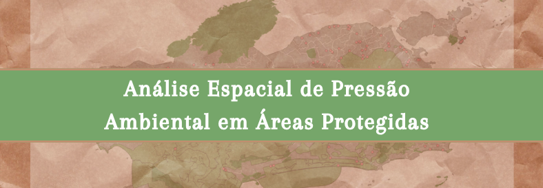
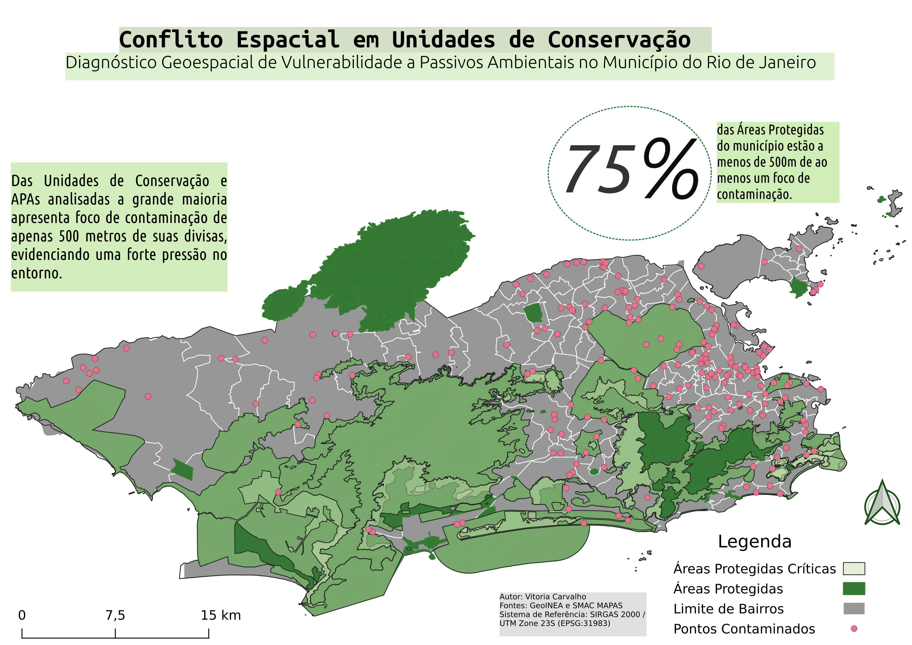

   

## Visão Geral
Este projeto realiza uma análise espacial de sobreposição e proximidade entre **Áreas Protegidas (Unidades de Conservação e APAs)** e **Focos de Áreas Contaminadas** no município do Rio de Janeiro. 

O objetivo é ranquear e quantificar as áreas protegidas em situação de vulnerabilidade crítica a até 500m de pontos de contaminação ambiental.

---

## Tecnologias e Ferramentas
* **PostgreSQL / PostGIS**: Banco de dados geoespacial e consultas de proximidade (`ST_DWithin`, `ST_Transform`).
* **QGIS**: Visualização cartográfica, simbologia temática e validação espacial.
* **Docker**: Containerização da instância do banco de dados geoespacial.
  
##                                Mapa Temático da Análise Espacial

---

## Principais Achados 
* **75% de Exposição Crítica:** Três em cada quatro Áreas Protegidas e APAs analisadas no município do Rio de Janeiro possuem ao menos um foco de contaminação registrado a menos de 500 metros de suas divisas.
* **Pressão no Entorno:** A alta densidade de passivos ambientais nos vetores de borda evidencia uma forte pressão antropogênica contínua sobre as zonas de amortecimento das Unidades de Conservação.
* **Agilidade em PostGIS:** Utilização de consultas espaciais vetorizadas (`ST_DWithin` + `ST_Transform` no EPSG:31983) para automatizar o cruzamento de grandes bases de dados geográficos locais.
